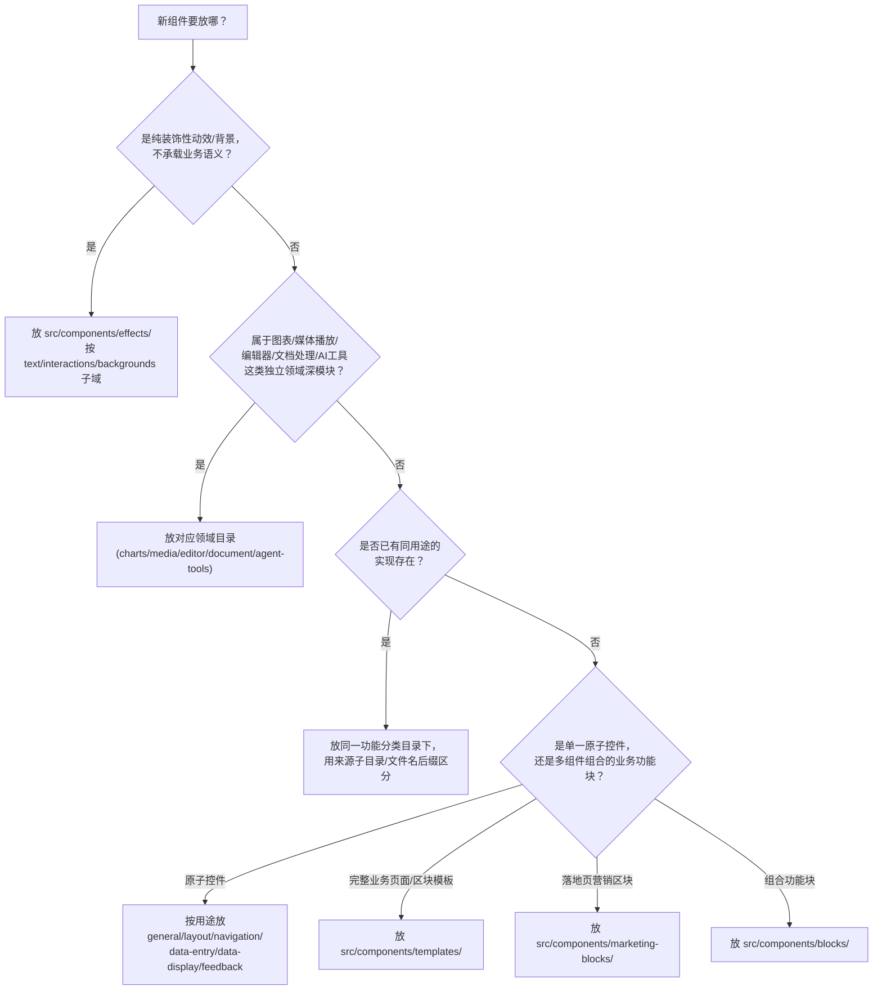

# 组件库目录架构（Stage A + Stage A+ + Stage B 落地版）

> 本文档描述 `src/components/` 的目标目录结构。Stage A（`src/components/` 内部物理搬迁）、Stage A+（`src/hooks/`、`src/lib/`、`src/primitives/` 二次搬迁）、**Stage B（487 个 `ui/` 转发壳改名 + 引用同步 + `catalog.ts` 按功能分类重写）** 均已落地。

## 核心原则

1. **按实际用途分类，不按来源库分类**。不存在"这个组件从 dice/gooseui/react-bits 搬来的所以放一起"这种组织逻辑，只有"这个组件是干什么用的"。
2. **同用途的多个实现允许共存，不做删除/合并判断**。用子目录/文件名后缀区分（如 `-legacy`、`-headless`、`-widget` 后缀，或来源子目录）。
3. **`ui/`、`blocks/` 暂不在 Stage A 范围内**：`ui/` 是全项目稳定公共 API 面（`@/components/ui/xxx`），`blocks/` 是既有的复合业务区块概念，两者的内部内容是否需要按新分类重新组织、`ui/` 转发壳是否要跟着改名，属于 Stage B 的工作（用户已确认 Stage B 要做，但物理挪动顺序上放在 Stage A 之后）。
4. **`base/`、`patterns/` 暂不处理**：`base/`（154 个文件，疑似旧版 react-bits 快照/死代码）与 `patterns/`（占位目录）留待后续单独评估，本轮不做取舍。

## 顶层目录结构

| 目录 | 内容 | 来源（Stage A 迁移前） |
| --- | --- | --- |
| `ui/` | 全项目稳定公共 API 面：shadcn 主线原子组件 + Plate 节点组件 + 各种转发壳/包装壳 | 不变（Stage B 处理） |
| `blocks/` | 复合业务区块 | 不变 |
| `charts/` | 所有图表实现 | `bklit/` 整体、`evilcharts/` 整体（`ui/chart.tsx` 主线实现暂留在 `ui/`，`agent-tools/chart/` 是 AI 场景变体，保持独立不挪入本类） |
| `media/` | 音视频播放器 | `limeplay/` 整体（直接改名，不再保留 vendor 前缀） |
| `editor/` | 富文本编辑器 | 原 `editor/` + 合并原 `plate/`（`plate/components/plate-editors-showcase.tsx` → `editor/editors-showcase.tsx`，`plate/` 已删除） |
| `document/` | PDF/Excel/Docx/OCR 等文档处理场景 | `extend/` 整体（直接改名） |
| `agent-tools/` | AI 对话/Agent 场景专属小组件，明确不与同名通用组件合并 | `tool/` 整体（直接改名） |
| `effects/` | 纯装饰性动效/背景，不承载业务语义。内部按 `text/`、`interactions/`、`backgrounds/` 三个子域分片，子域下再按原始来源分子目录 | `react-bits/` 的 Animations+Backgrounds+TextAnimations+部分 Components、`chamaac/` 的 shader 特效子集、`gooseui/` 的 3 个特效 + `animate-ui/` 图标原语、`uselayouts/` 的交互型条目、`sabraman/` 的 roundbit |
| `marketing-blocks/` | 落地页/营销区块（header/footer/hero/faq...） | `gooseui/` 的 `blocks/*`（17 个）、`react-bits/` Components 里的展示卡片子集、`chamaac/` 的 feature-steps/how-it-works |
| `templates/` | 完整业务页面/区块模板（按业务域分子目录，如 blogging/events/payment/social...） | `manifest/` 的绝大部分（拆出 empty-state/file-uploader/date-time-picker，见下）、`uselayouts/` 的 pricing-card |
| `general/` | 按钮/主题切换等基础通用件、无渲染 headless 工具 | `gooseui/` 主题类、`sabraman/` 的 legacy-code-block-command、`chamaac/` 的按钮类、`uselayouts/` 的按钮类、`dice/` 的 headless 工具（`general/dice/headless/`） |
| `layout/` | 页面结构容器 | `uselayouts/` 布局类、`dice/` 的 stack/scroller |
| `navigation/` | 页面/内容导航 | `uselayouts/` 导航类、`gooseui/` 的滚动/锚点类、`react-bits/` Components 里的导航型、`chamaac/` 的 dock、`dice/` 的 action-bar/speed-dial/scroll-spy/stepper 等、`sabraman/` 的 legacy-bar-button |
| `data-entry/` | 表单输入控件 | `dice/` 全部输入类控件（含 checkbox-group/mention/tags-input 复合原语）、`uselayouts/` 表单类、`gooseui/` 的 smart-form、`sabraman/` 的 legacy-slider/switch/segmented-control、`manifest/` 拆出的 file-uploader、date-time-picker、`chamaac/` 的 ai-input |
| `data-display/` | 展示型组件，含数据表格子域 `data-table-filters/` | `dice/` 展示类控件、`gooseui/` 的 digital-clock 等、`chamaac/` 的 stats-cards/carousel、`uselayouts/` 的 empty-testimonial 等、`manifest/` 拆出的 empty-state、原 `data-table-filters/` 整体 |
| `feedback/` | 状态反馈 | `dice/` 的 responsive-dialog/circular-progress、`sabraman/` 的 legacy-alert-dialog/notification、`gooseui/` 的 custom-toast |
| `_shared/` | 各已拆分 vendor 库遗留的共享 hooks/lib/全局样式，以及原 `src/hooks/`、`src/lib/` 中"仅被 `src/components/` 内部消费"的通用 hooks/工具 | `gooseui/`、`chamaac/`、`uselayouts/`、`dice/`、`sabraman/` 拆分后剩余的 `hooks/`、`lib/`、`globals.css`、`index.ts`；`_shared/hooks/`、`_shared/lib/`（无 vendor 前缀，即 Stage A+ 从 `src/hooks/`、`src/lib/` 迁入的主线通用代码） |
| `_primitives/` | 组件库内部实现层：Radix 行为封装 + 动效原语，被 `ui/*.tsx` 转发壳在实现细节上依赖，不对外单独暴露/编目 | Stage A+ 整体迁入自旧 `src/primitives/`（`radix/`、`animate/`、`effects/`、`texts/` 四个子域，结构不变） |
| `base/` | 疑似未引用的旧版 react-bits 快照 | 不变，待后续单独评估 |
| `patterns/` | 空占位目录 | 不变 |

## Stage A+：`src/styles`、`src/primitives`、`src/lib`、`src/hooks` 二次迁移

Stage A 只处理了 `src/components/` 内部。但 `src/` 下与 `components/` 平级的四个目录，历史上是"合并 animate 相关库"时人为拆出去的，当时组件库规模较小、拆分理由是"组件库只承担组件职责，通用 hooks/lib/动效原语不要混进组件库，避免出现多套重复实现"。现在组件库已经膨胀为 14 个功能域、上千文件，这个历史拆分需要用实际引用数据重新评估，而不是延续当年的直觉判断。逐目录核实结果：

| 目录 | 核实方法 | 结论 | 处理 |
| --- | --- | --- | --- |
| `src/styles/` | `rg` 全仓库引用 | 只被 `src/app/main.tsx` 一处全局导入（Tailwind/主题/MDX 排版 CSS），与 `components/` 无耦合，是正常的 App 级全局样式入口 | **不动**，保留在 `src/styles/` |
| `src/lib/utils.ts` | `rg` 引用统计：296 处引用，其中 10 处在 `src/components/`、`src/primitives/` 之外 | `cn()` classname 工具，被 `src/app/`、`src/gallery/` 广泛使用，是真正的全局工具 | **不动**，保留在 `src/lib/` |
| `src/lib/uploadthing.ts` | 同上：2 处引用，均在 `components/`/`primitives/` 之外 | 第三方上传服务封装，App 级服务集成，不是组件实现细节 | **不动**，保留在 `src/lib/` |
| `src/lib/{block-discussion-index,compose-refs,get-strict-context,markdown-joiner-transform,suggestion}.ts(x)` | 同上：全部引用（合计 38 处）均在 `src/components/`（含 `primitives/`）内部，仓库其余部分 0 引用 | 100% 组件库内部实现细节（Plate 编辑器节点、compound component context 等），被错放在顶层 `lib/` | **迁移**：`src/lib/*.ts(x)` → `src/components/_shared/lib/*.ts(x)`（这 5 个文件） |
| `src/hooks/*`（12 个文件） | 逐个 `rg` 引用统计 | 全部 12 个文件的引用 100% 落在 `src/components/`（含 `primitives/`）内部，仓库其余部分 0 引用；说明这批 hooks 并非真正"全局通用"，而是组件库内部（file-upload/masonry/sidebar/Plate 等）专用的实现细节，只是历史上被放在了顶层 | **迁移**：`src/hooks/*` → `src/components/_shared/hooks/*`（全部 12 个文件） |
| `src/primitives/{radix,animate,effects,texts}/`（29 个文件） | `rg` 引用统计 + 逐个消费方追踪 | 0 处引用落在 `src/components/`/`src/primitives/` 之外；且 `primitives/radix/*` 与 `ui/*.tsx` 同名一一对应，被 `ui/accordion.tsx`、`ui/switch.tsx`、`ui/sheet.tsx` 等**直接作为实现层导入**（`ui/` 转发壳 + `primitives/radix/` 真实实现的分层模式）；`primitives/effects/particles.tsx`、`primitives/texts/scrolling-number.tsx` 与已迁入 `effects/backgrounds/`、`data-display/gooseui/` 的同类实现构成潜在重复；另有 7 个文件（`radix/dialog.tsx`、`radix/tooltip.tsx`、`radix/alert-dialog.tsx`、`radix/checkbox.tsx`、`radix/dropdown-menu.tsx`、`radix/popover.tsx`、`animate/button.tsx`）当前 0 引用，是孤儿文件 | **迁移**：`src/primitives/*` → `src/components/_primitives/*`（保留 `radix/animate/effects/texts` 四个子域结构不变；孤儿文件按"只搬迁不删除"原则一并迁入，不做取舍） |

**执行方式**：与 Stage A 一致的暴力物理迁移（`git mv` 移动文件，随后用脚本把 `@/hooks/*`、`@/primitives/*`、`@/lib/{5个文件}` 的 import 路径批量重写为 `@/components/_shared/hooks/*`、`@/components/_primitives/*`、`@/components/_shared/lib/*`）。由于这批引用只存在于 `.ts`/`.tsx` 源码文件中（`rg` 确认 0 处出现在 `content/**/*.mdx` 的可执行 import 语句里），路径修复没有触碰任何 mdx 文档内容，不违反"Stage B 暂停/不碰 mdx"的约束；`pnpm typecheck` 校验确认改动前后错误集合一致，没有引入新的编译错误。

**已知遗留（未处理，留给未来）**：

1. **mdx 文档正文提及的旧路径**（非 import 语句，纯文字说明，不影响编译）：`content/components/tooltip-motion/index.mdx`、`content/components/tabs-motion/index.mdx`、`content/components/alert-dialog/index.mdx`、`content/components/context-menu/index.mdx` 共 4 处提到了 `@/primitives/...`，需要在 Stage B 统一处理 mdx 时一并修正。
2. **vendor 内部仍各自持有一份同名 hooks 副本**：Stage A+ 只解决了"被主线 blocks/primitives 直接依赖"的那一份 `use-as-ref`/`use-lazy-ref`/`use-isomorphic-layout-effect`/`compose-refs`，但 `_shared/dice/hooks/`、`_shared/gooseui/hooks/`、`_shared/uselayouts/hooks/` 内部各自还留有自己的同名/同功能副本（各 vendor 组件内部消费，互不干扰，编译不受影响）。这是更深一层的"多套重复实现"，属于内容合并判断而非结构搬迁，本轮不处理，记录在此供后续单独评估是否收敛为一份。

## Stage A++：`_shared`/`_primitives` 自身合理性复核 + 组件树内散落的 `lib`/`hooks`/`types`/`globals.css`

Stage A+ 完成后发现两类新问题：一是 `_shared/`、`_primitives/` 这两个顶层"非组件"目录本身是否合理、要不要合并；二是搬迁之后，`src/components/` 内部到处能看到裸露的 `lib/`、`hooks/`、`types/`、`globals.css`，需要逐一核实是"正常的"还是"又一层没收口的重复"。

### 1. `_primitives` vs `_shared`：结论是保留两个不同的名字，但修掉 `_shared` 内部的伪劣结构

两者代表两种本质不同的东西，不应该合并成一个目录：

- **`_primitives/`**：第一方基础实现层，来源单一（都是本项目自己写的 Radix 封装/动效原语），且被 `ui/*.tsx` 转发壳当作**唯一真实实现**直接依赖（`ui/switch.tsx` 的壳 + `_primitives/radix/switch.tsx` 的肉，是一套连贯的分层设计）。
- **`_shared/`**：多个已解散 vendor 库（dice/gooseui/uselayouts/sabraman）拆分到各功能域后，剩下"哪个新目录都不该占为己有"的公共基础设施收纳桶，来源异构、质量参差，天然就该是个"暂存区"性质的名字。

保留两个名字是对的，但审计发现 `_shared/` 内部本身有需要清理的结构问题（详见下表），已一并处理：

| 发现 | 证据 | 处理 |
| --- | --- | --- |
| `_shared/dice/_shared/` 双重 `_shared` 嵌套，语义无法从名字辨认（"共享的共享"？） | 内容是 dice 库自带的 Base-UI 风格底层原语工具包（`create-context`/`portal`/`presence`/`primitive`/`slot` 等），与同级 `_shared/dice/hooks`、`_shared/dice/lib`（dice 自己另一套更简单的工具）是两码事；被 `data-entry/dice/checkbox-group|mention|tags-input` 3 组复合原语的 21 个文件直接依赖，非死代码 | **改名**：`_shared/dice/_shared/` → `_shared/dice/internal/`（复用本仓库在 `media/internal/` 已有的"内部实现细节"命名约定，而不是发明新词），同步修正 21 处 import |
| `_shared/chamaac/`（`globals.css`、`index.ts`、`_shared/hooks/use-favourites.ts`） | 全仓库 `rg` 广度搜索（含相对路径、alias 路径、`.css` import）确认 0 引用；chamaac 组件本体（`ui/chamaac-*.tsx` 等）大量在用，但没有一个引用这个 `_shared` 收纳桶 | **删除**（3 个文件，确认孤儿，符合本轮"确认零引用可删"先例） |
| `_shared/uselayouts/_shared/ui/` | 空目录（连一个文件都没有），大概率是 Stage A `mv` 过程中残留的空壳 | **删除**空目录 |

`pnpm typecheck` 复核：改动前后错误集合一致，无新增。

### 2. `src/components/` 内部散落的 `lib`/`hooks`/`types`：核实后确认是合理的领域内聚，不处理

搜索了全组件树内所有裸露的 `lib/`、`hooks/`、`types/`（`_shared/`、`_primitives/` 之外），发现集中在 `document/`、`media/`、`charts/evilcharts/`、`charts/bklit/`、`templates/manifest/`、`marketing-blocks/gooseui/complex-component/`、`data-display/data-table-filters/` 这几个域。逐一检查后发现一个共同模式：这些目录都是**整体搬迁、未被拆散的单一领域模块**（如 `document/` = 原 `extend/` 整体改名），内部固定是 `组件/（components/）+ 私有 hooks/ + 私有 lib/ + 私有 types/ + index.ts 网关`的结构，且这些 `hooks/lib/types` 只服务于该领域自己的组件，不被其他领域引用。

这是业界公认的"feature folder / 领域内聚"标准做法（参考 bulletproof-react 等主流 React 大型项目规范：每个 feature 自带 `components/hooks/lib/types` 子目录，用 `index.ts` 作为对外网关，内部实现细节不对外暴露），和 `_shared/` 那种"vendor 解散后没人认领的公共代码"是完全不同的性质，**不需要改动**，改了反而破坏了每个领域的内聚性。

判断标准总结（后续新增组件可参照）：

- 这批 `lib/hooks/types` 只被**同一个领域目录**内部消费 → 留在原地，是正常的领域内聚，不算"乱"。
- 这批代码被**多个不同功能域**共同依赖，且找不到单一自然归属 → 才应该收纳进 `_shared/`。
- 只有本仓库自己写的、构成 `ui/` 转发壳真实实现的基础层 → 归 `_primitives/`。

### 3. `globals.css` 是例外，上面"领域内聚就不用管"的结论对它不适用——已删除 5 个

`lib/hooks/types` 是**逻辑代码**，天然可以按领域内聚（各域只服务自己）。但 `globals.css` 装的是**设计令牌（design tokens：`--background`/`--primary`/`--radius` 等 CSS 变量）**，这是全局唯一应该有一份的东西，不存在"某个领域自己的一套颜色变量"这种合理场景——这一点被用户指出后核实确认判断有误，原先的"领域内聚，不用动"结论不能一概套用到 `globals.css` 上。

核实发现全组件树有 5 个 `globals.css`：`document/globals.css`（507 行）、`charts/evilcharts/globals.css`（131 行）、`templates/manifest/globals.css`（400 行）、`_shared/gooseui/globals.css`（357 行）、`_shared/uselayouts/globals.css`（233 行），每一个都**独立重新定义了一整套 `:root`/`.dark` 设计令牌**（`--background`/`--primary`/`--radius`/`--sidebar-*`/`--chart-*` 等），且数值互不相同（例如 `document/globals.css` 的 `--primary` 是 `var(--color-neutral-800)`，`charts/evilcharts/globals.css` 的 `--primary` 是 `oklch(0.205 0 0)`，`src/styles/theme.css`——即当前应用真正生效的全局主题——的 `--primary` 又是另一个值）。这正是用户担心的场景：以后要批量改一个品牌色，理论上要去改好几个地方。

但进一步核实发现更关键的事实：这 5 个文件**全部是死代码**——全仓库 `rg` 广度搜索（`.ts`/`.tsx` 的 import、其他 `.css` 的 `@import`、`source-registry.ts` 的 raw 引用、`vite.config` 特殊处理）确认**没有任何一处引用**它们，唯一的例外是一处过期代码注释（已顺手修正）。逐个打开确认内容后，可以看出这些文件是各 vendor 库原本作为**独立 demo/文档站**时自带的 Tailwind 入口文件（`@tailwind base/components/utilities` 或 `@import "shadcn/tailwind.css"`），随整包被搬进本仓库时被当作普通文件一起带了进来，但从未被真正接入应用（应用只认 `src/styles/index.css` → `src/styles/theme.css` 这一条链路）。`document/globals.css` 甚至 `@import` 了 3 个早已不存在的文件（`./shadcn-tailwind.css`、`./legacy-themes.css`、`../registry/styles/style-vega.css` 等 7 个主题文件），进一步证实是完整的死链。

**处理**：5 个 `globals.css` 全部删除（而不是"合并成一份"——因为它们当前 0 引用，没有内容需要合并，合并反而会让"到底哪份在生效"更难判断）。删除后，全仓库真正生效的设计令牌来源变成唯一的一处：`src/styles/theme.css`。顺手修正了 `navigation/gooseui/scroll-progress.tsx` 里一处提到"globals.css"的过期注释。`pnpm typecheck` 复核错误集合与删除前完全一致，无新增（CSS 文件不参与 TS 编译图，预期之内）。

## 早期遗留问题：`src/app/api/` 混入 Next.js 专属代码（已隔离）

审计发现 `src/app/api/ai/{command,copilot}/route.ts`、`src/app/api/uploadthing/route.ts` 共 3 个文件（及 `command/` 下 `utils.ts`、`prompt/*.ts` 5 个专属辅助文件）使用 `next/server`（`NextRequest`/`NextResponse`）、`uploadthing/next`，是 **Next.js App Router 的 `app/api/**/route.ts` 文件约定专属写法**——这批文件是集成 Plate.js 编辑器 AI 功能时，从 Plate 官方 demo（Next.js 项目）原样带过来的，从未在本项目（Vite + TanStack Router SPA）里被适配或真正运行过：

- 仓库未安装 `next` 包，这些文件此前一直让 `pnpm typecheck` 报 `TS2307: Cannot find module 'next/server'`（4 处报错）。
- `vite.config.ts` 的 `routesDirectory` 只指向 `src/app/routes`，Vite/TanStack Router 都不识别 `app/api/**/route.ts` 约定，这批文件从未被当作真实端点执行。
- 前端调用方（`src/components/editor/use-chat.ts`、`copilot-kit.tsx`）本身已内置"路由未实现"时的假流式兜底逻辑，AI 编辑器功能一直靠这个 mock 运行，从未依赖过这批文件。
- `src/app/api/` 此前从未出现在本文档任何一轮审计范围里，是纯粹的审计盲区。

**处理**：整体迁移到 `references/next-api-routes/`（该目录已在 `eslint.config.js` 用 `globalIgnores` 排除，且不在任何 `tsconfig` 的 `include` 范围内，不再参与 typecheck/lint），保留代码内容和目录结构不变，附 README 说明背景与未来若要接入真实后端时的迁移路径。`src/lib/uploadthing.ts`（`ourFileRouter` 定义）未移动，继续留在 `src/lib/`，沿用 Stage A+ 的既有结论。`pnpm typecheck` 复核：错误数从 802 降至 798，减少的 4 处正好是这 3 个文件的 `next/server` 报错，其余错误集合不变。

## `_shared/` 说明（已知的 Stage A 遗留问题）

拆分每个 vendor 库时，绝大多数组件文件都能明确归类，但每个库还留了一批`hooks/`、`lib/`、`globals.css`、`index.ts` 这类被库内部多个组件共用的基础设施代码。这些代码具体被拆分后的哪些新目录依赖，需要逐条 `rg` 引用分析才能精确拆分，属于 Stage B 的工作（届时会和修复 import 路径一起处理）。目前统一临时存放在 `_shared/<原库名>/` 下，不代表最终归属。

## 同用途多实现共存的命名规范

当一个功能分类目录下出现多个不同来源、相同用途的实现时，用后缀/子目录区分，不删除、不合并：

- 文件名冲突：加语义后缀，如 `checkbox-group-widget.tsx`（原 `dice/ui/checkbox-group.tsx`，与 `data-entry/dice/checkbox-group/` 复合原语区分）、`mention-widget.tsx`、`tags-input-widget.tsx`。
- 明确是"旧版/替代风格"的：保留原名中的 `legacy-` 前缀（来自 sabraman），如 `data-entry/sabraman/legacy-slider.tsx` 与 `data-entry/dice/`、主线 `ui/slider.tsx` 并存。
- 明确是"无样式版"的：`dice/` 的工具型控件大多本身就是 headless/无样式实现，放在 `general/dice/headless/` 或对应功能目录下，通过所在子目录（`dice/`）区分来源即可，无需额外改名。
- 主线 shadcn 实现（`ui/switch.tsx`、`ui/slider.tsx` 等）本身不受本轮影响，继续留在 `ui/`，Stage B 会决定是否需要在文档/`catalog.ts` 层面把它们与同用途的 vendor 实现相邻展示。

## 已知的同用途重复清单（发现记录，不做处理）

| 用途 | 主线(`ui/`) | 分类目录下的其他实现 |
| --- | --- | --- |
| Switch | `ui/switch.tsx` | `data-entry/sabraman/legacy-switch.tsx`（`ui/dice-switch.tsx` 若存在，Stage B 处理） |
| Slider | `ui/slider.tsx` | `data-entry/sabraman/legacy-slider.tsx`、`ui/gooseui-slider.tsx`（Stage B 处理） |
| Checkbox | `ui/checkbox.tsx` | `data-entry/dice/checkbox-group-widget.tsx`、`ui/gooseui-checkbox.tsx`（纯转发，Stage B 处理） |
| AlertDialog | `ui/alert-dialog.tsx` | `feedback/sabraman/legacy-alert-dialog.tsx` |
| Notification | `ui/notification.tsx` | `feedback/sabraman/legacy-notification.tsx` |
| Carousel | `ui/carousel.tsx` | `data-display/chamaac/carousel/` |
| Dock | （无主线实现） | `navigation/react-bits/dock.tsx`、`navigation/chamaac/dock/` |
| Gauge | （无主线实现，图表域） | `charts/dice/gauge.tsx`、`charts/chamaac/gauge/`、`charts/bklit/` 内的 gauge |
| EmptyState | `ui/empty-state.tsx` | `data-display/manifest/empty-state.tsx` |
| FileUpload | `ui/file-upload.tsx` / `blocks/file-upload/` | `document/file-upload.tsx`（原 extend）、`data-entry/manifest/file-uploader.tsx` |

## 新组件放置决策树



## Stage B 待办（部分已落地：Registry 架构）

### 已落地：声明式 Component Registry（取代大规模 ui/ 转发壳）

`src/gallery/registry/` 现为 Gallery 的**唯一数据源**，取代原先 `catalog.ts`、`source-registry.ts`、`resolve-showcase.ts` 各自猜测路径的模式：

| 文件 | 职责 |
| --- | --- |
| `schema.ts` | `ComponentRegistryItem` 类型：`internalImportPath`（本仓库真实 import）、`registryTarget`（未来 shadcn 安装落点）、`displayImportPath`（复制按钮展示） |
| `domains/pilot.ts` | gooseui + chamaac 打样条目（手工精修） |
| `domains/generated.ts` | 由 `pnpm sync:registry` 从剩余 ui/ 转发壳扫描生成 |
| `index.ts` | 聚合全部 registry 条目 + 查询 API |
| `source-loader.ts` | `import.meta.glob` 按 `files[].path` 取真实源码 |
| `derive-catalog.ts` | 从 registry 派生 `GalleryNavItem` |

**维护命令：**

```bash
pnpm sync:registry          # 扫描 ui/ 壳 → 更新 generated.ts
pnpm check:registry         # 校验 id 唯一、docsSlug 存在、路径可解析
pnpm codemod:registry-examples  # 批量改 examples import
pnpm codemod:registry-docs      # 批量改 llm.txt / index.mdx 文档路径
pnpm delete:registry-shells     # 删除已登记且无源码引用的纯转发壳
```

**路径语义（关键）：** shadcn registry 的 `name` 只解耦「安装项 identity」与「源文件路径」，不代表可以 import 不存在的路径。本仓库内部一律使用 `internalImportPath` 指向真实实现；`ui/` 只保留 ~196 个主线 shadcn 真实组件 + 35 个含包装逻辑的组件，不再充当大规模公开名映射层。已删除 220+ 纯转发壳。

### 仍待完成

1. 剩余未登记 ui/ 壳（含 `default as` 改名等 35 个非纯转发）的 registry 登记或保留决策。
2. 批量更新 `content/**/*.mdx` 中 Stage A+ 遗留的 4 处 `@/primitives/...` 文档正文提及。
3. `api-registry.ts` key 与 registry `id` 统一。
4. 重写 `catalog.ts`：`GALLERY_NAV_GROUPS` 从「按 libraryId 分组」改为「按功能分类分组」，并修复 react-bits 重复注册。
5. 逐一拆解 `_shared/` 下各库遗留的 hooks/lib。
6. 全量 `tsc -b` + `eslint` + `rg` 零引用校验。
